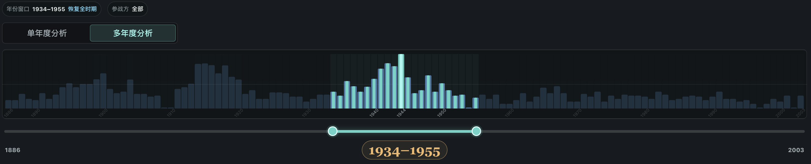
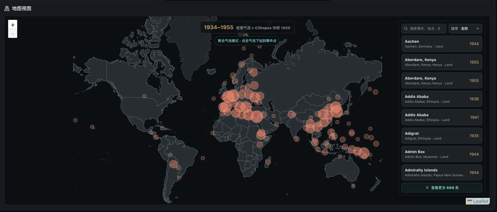
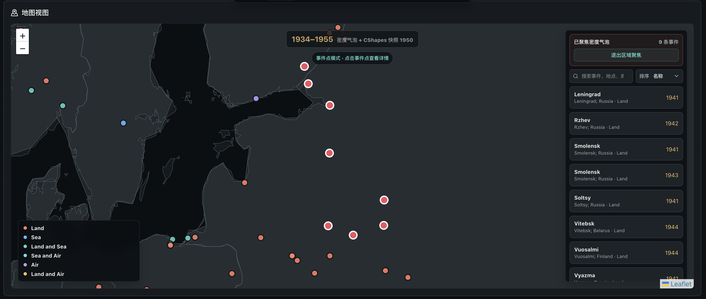
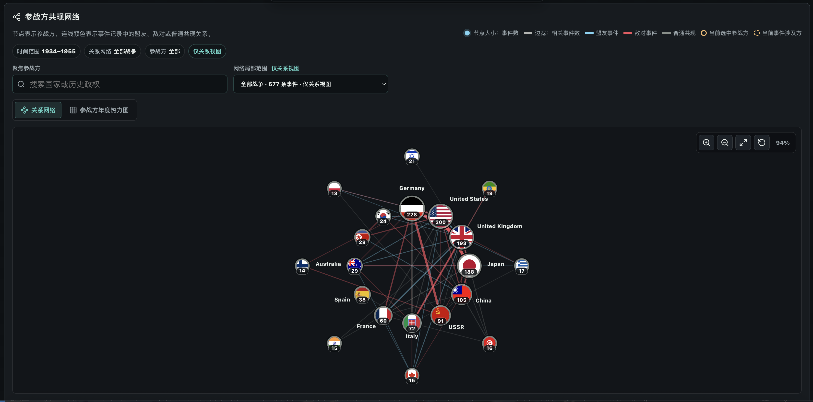
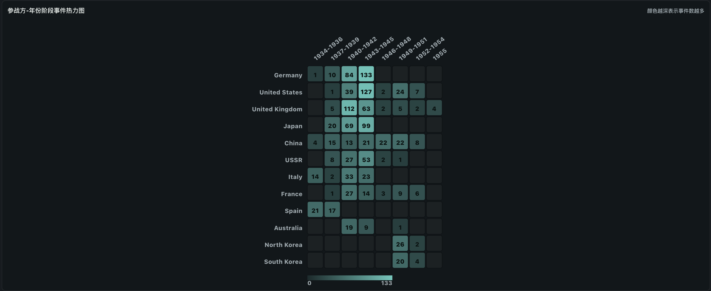
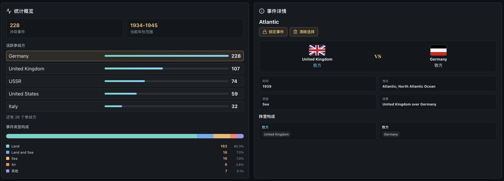
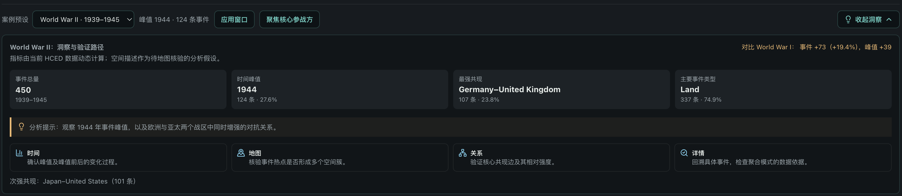

# BattleMap 系统文档

## 1. 系统概述

BattleMap 是一个面向全球军事冲突事件的时空可视分析系统。系统使用 Historical Conflict Event Dataset (HCED Data v3) 中 1886-2003 年的军事冲突事件作为主数据，并叠加 CShapes 2.0 历史国家/领土边界，帮助用户在同一分析状态下观察冲突事件的时间集中、空间分布、参战方共现关系和原始事件证据。


系统的核心分析路径是：

1. 通过年度时间轴定位冲突事件集中的年份或时间窗口。
2. 在历史边界地图上核验事件发生地点和空间聚集区域。
3. 使用参战方共现网络和年度热力图解释关系结构。
4. 通过事件详情面板回到原始记录，检查聚合图形背后的证据。

这一路径对应 Barbara Tversky 的 “overview first, zoom and filter, details on demand” 思路。用户先从全局时间概览进入，再通过地图、关系图和详情面板逐步缩小问题范围，避免只凭单一统计表或单张图表作出结论。

## 2. 设计需求与分析任务价值

### 2.1 系统解决的数据分析问题

BattleMap 关注的不是预测某场战争的胜负，也不是给冲突强度建立单一排序，而是解决一组相互依赖的探索式分析问题：

- 时间问题：冲突事件在什么年份或阶段集中？峰值年份是否出现在战争早期、中期还是末期？
- 空间问题：同一时间窗口内事件集中在哪里？是否存在多个战区或跨区域扩散？
- 关系问题：哪些参战方频繁共同出现在事件记录中？核心共现关系是否随时间窗口变化？
- 证据问题：图表中的峰值、聚集和关系能否回溯到具体事件记录？

这些问题具有明显的多维特征。时间、地点、参战方和事件类型之间并不是相互独立的字段，而是共同构成历史冲突过程的上下文。例如，某一年事件数上升并不一定表示单一区域冲突增强；它可能来自多个战区同时活跃。某两个参战方共现次数高，也不必然表示联盟或敌对关系，需要结合事件记录、胜负方字段和空间位置继续判断。

### 2.2 为什么值得用可视化而非纯统计或机器学习

纯统计方法可以回答“哪个年份最多”“哪个参战方出现最多”等问题，但难以同时表达时间峰值、空间分布、历史边界和参战方关系。表格或排名会把数据拆成孤立指标，用户需要在多个结果之间人工来回对照，容易忽略跨维度模式。

机器学习方法可以做聚类、分类或预测，但本项目的主要目标不是自动给出唯一答案，而是帮助用户发现、解释并核查模式。对于历史冲突数据，分析者往往需要知道结论来自哪些年份、哪些地点和哪些原始事件。可视化系统能够保留这种可解释性：用户既能看到聚合模式，也能随时下钻到具体记录。

因此，BattleMap 的价值在于把统计结果放回时空和关系语境中，使用户能够完成“发现模式-提出假设-跨视图验证-回溯证据”的分析闭环。

## 3. 数据来源、处理与系统完整度

### 3.1 数据来源与规模

系统当前使用的数据包括：

- 主数据：Historical Conflict Event Dataset (HCED Data v3)。
- 时间范围：1886-2003 年。
- 前端有效事件：1,920 条具有年份和经纬度的冲突事件。
- 历史边界：CShapes 2.0 国家/领土边界快照。
- 规范化参战方：80 个国家、历史政权或可进入网络分析的联盟实体。
- 前端数据体量：HCED CSV 约 2.31 MB，CShapes 历史边界快照约 11.57 MB。

需要说明的是，HCED 记录的是 military conflict event，不保证每条记录都是狭义的 battle。CShapes 表示国家或领土边界，不表示战线、占领区或实际控制线。系统在界面和文档中保留这些限制，避免对历史语义作过度解释。

### 3.2 数据清洗与规范化

数据处理由 Node.js 脚本完成，主要包括：

- 过滤无有效年份或经纬度的记录。
- 将 HCED 字段映射为前端统一事件结构。
- 清洗战争名称、事件名称、地点、事件类型和结果字段。
- 对 `Participants`、`Winner`、`Loser`、`Participant 1/2` 等字段进行参战方抽取。
- 使用人工维护的 normalization CSV 规范化国家、历史政权和联盟名称。
- 保留 `raw_participants`、`source`、`narrative` 等字段，便于事件详情回溯。
- 生成 1886-2003 年范围内可用于前端加载的 CShapes 历史边界快照。

这种处理方式兼顾了可视化分析和数据可追溯性。一方面，前端需要稳定的参战方 ID 才能进行筛选、统计和网络构建；另一方面，历史数据存在别名、政权更替和字段不完整问题，因此系统保留原始文本字段，供用户在详情面板中核查。

### 3.3 前后端分工与可复现性

系统采用 React + Vite + TypeScript 构建，是一个无需后端服务即可运行的前端应用。数据清洗和快照生成在构建阶段完成，前端负责：

- 加载 CSV 与 GeoJSON 静态资源。
- 根据年份窗口和参战方筛选事件。
- 计算年度分布、事件摘要、地图聚合、参战方统计和共现网络。
- 维护跨视图共享状态。
- 将当前分析状态写入 URL，便于复现和分享。

完整复现命令如下：

```bash
npm install
npm run build:hced
npm run build:cshapes
npm test
npm run build
npm run test:e2e
```

首次运行端到端测试前需要安装 Chromium：

```bash
npx playwright install chromium
```

### 3.4 性能与完整度

系统针对前端运行做了几项控制：

- 地图在单年模式下渲染具体事件点，在多年模式下渲染网格密度气泡，避免一次性绘制过多点。
- 网络视图限制可见节点和边数量，优先展示高频参战方和强共现关系。
- 时间、统计和筛选结果通过 React memoized 派生状态计算，减少重复聚合。
- 数据加载失败时提供错误提示和重试入口。
- 单元测试覆盖筛选、状态恢复、统计聚合、地图热力格、网络分析和案例指标。
- Playwright 端到端测试覆盖时间、地图、关系视图联动和 URL 状态恢复。

## 4. 可视化设计介绍与设计质量


### 4.1 时间视图



时间概览使用年度柱形图表示长期事件分布。柱高编码年度事件数，当前筛选结果以内层柱或强调状态显示，当前年份和时间窗口通过描边、标签和区间 brushing 表示。

这种设计适合回答“什么时候集中”的问题。年度柱形图比折线图更符合离散年份事件计数的性质，也便于比较峰值年份与相邻年份。用户可以在单年模式查看具体年份，也可以在多年模式选择一个分析窗口。

### 4.2 地图视图




地图视图使用 Leaflet 呈现冲突事件位置，并叠加 CShapes 历史边界。系统区分两类地图语义：

- 单年模式：显示当前年份的具体事件点，强调位置和可点击下钻。
- 多年模式：显示 8 度网格密度气泡，使用大小和亮度编码窗口内事件集中程度。

这一设计避免把“某一年具体事件”和“多年聚合密度”混为同一种符号。地图还显示分析时间范围、地图参考年份和实际采用的 CShapes 快照年份，使历史边界的解释更明确。

事件类型使用颜色区分，例如 Land、Sea、Air 等；选中事件使用更高亮的描边和尺寸编码。位置编码负责表达地理分布，大小和亮度负责编码聚集强度，颜色主要用于类别识别而非冲突严重程度。

### 4.3 关系视图




关系视图以参战方共现网络展示“谁与谁经常出现在同一事件中”。节点大小编码参战方事件数，边宽编码共现次数，颜色和国旗用于辅助识别历史实体和当前选择状态。

系统同时提供参战方年度热力图作为补充视图，用于比较高频参战方在不同时间段中的活跃程度。网络适合观察关系结构，热力图适合观察参战方随时间变化的分布。二者通过模式切换呈现，避免在同一屏幕堆叠过多高密度图表。

### 4.4 统计与详情视图


统计面板提供事件数、主要战争、主要事件类型、参战方排名等摘要，作为图形分析的数值补充。详情面板展示选中事件的名称、年份、地点、类型、结果、胜负方、阵营构成和原始描述等信息。

详情视图不是附属信息，而是系统可解释性的重要组成部分。用户可以从地图气泡、事件列表或网络关系进入详情，检查某个聚合模式到底由哪些事件支撑。

### 4.5 针对数据特性的设计创新

BattleMap 的设计针对历史冲突数据做了几项定制：

- 将分析年份窗口、地图参考年份和实际历史边界快照分开显示，减少历史边界解释混淆。
- 在地图中区分单年度事件点和多年密度气泡，使同一视图服务于不同时间尺度。
- 以参战方共现网络表达关系，但在文档和界面中明确共现不等于联盟或敌对。
- 使用案例预设把时间、地图、关系和详情串成统一验证路径，而不是只展示静态指标。
- 保留历史实体名称、国旗和别名映射，提高参战方识别效率。

## 5. 多视图协调与交互设计

### 5.1 共享状态

系统的主要共享状态包括：

- `analysisMode`：单年模式或多年窗口模式。
- `currentYear`：地图和详情使用的当前年份。
- `selectedYearRange`：多年分析窗口。
- `selectedParticipant`：当前聚焦参战方。
- `selectedBattleId`：当前选中事件。
- `selectedBattleLocked`：详情事件是否锁定。

这些状态由顶层应用维护，并传递给时间、地图、网络、统计和详情视图。用户在任一视图中改变筛选条件，其他视图会同步更新。

### 5.2 Brushing & Linking

系统支持多种 brushing & linking：

- 在时间轴上选择年份窗口，会更新地图、统计、网络和案例指标。
- 在地图上点击事件，会更新详情面板，并在关系视图中高亮相关参战方。
- 在网络或统计面板中选择参战方，会反向过滤时间、地图和统计结果。
- 在事件列表或详情中定位事件，会同步当前年份和地图位置。
- 当前分析状态写入 URL，刷新或分享链接后可以恢复相同窗口、参战方和事件选择。

因此，系统中的视图不是彼此独立的展示板，而是共享同一语义状态的分析工具。时间视图负责定位，地图视图负责空间核验，网络视图负责关系解释，详情视图负责证据回溯。

### 5.3 Details-on-Demand

系统在多个层级提供 details-on-demand：

- 时间概览先显示年度总量，用户选择窗口后再查看局部详情。
- 地图默认显示事件点或聚合气泡，点击后展开事件列表和弹窗信息。
- 网络默认显示高频节点和强关系，点击节点或边后显示样本事件、关系类型和年份范围。
- 详情面板只在用户选择事件后展示完整记录，避免主界面被原始文本淹没。
- 案例预设默认提供简短叙事，应用后再展开动态指标和验证步骤。

这种交互结构使系统既能提供全局概览，也能在需要时暴露原始证据。

## 6. 案例展示：World War II 

### 6.1 案例目标

案例研究选择 World War II (1939-1945) 作为主案例，展示系统如何发现更细的结构差异：

- 峰值年份是否出现在同一阶段？
- 事件是否集中于单一空间区域，还是呈现多个战区？
- 高频参战方关系是否由一组关系主导，还是存在多个核心关系？
- 聚合结论能否回到具体事件记录中核查？

### 6.2 World War II 案例

在当前生成数据中，World War II 窗口包含 450 条事件。事件峰值出现在 1944 年，共 124 条，占窗口事件的 27.6%。主要事件类型为 Land，共 337 条，占 74.9%。高频共现关系包括 Germany-United Kingdom 107 条，以及 Japan-United States 101 条。



图 4：World War II case study 截图。系统将事件总量、峰值年份、事件类型和高频参战方关系放在同一验证路径中展示。

分析路径如下：

1. 应用 World War II 案例窗口，时间轴切换到 1939-1945 年。
2. 查看年度分布，发现 1944 年是窗口内峰值，而不是战争结束年份 1945 年。
3. 切换到地图，观察欧洲和亚太区域均存在明显事件聚集。
4. 打开关系视图，比较 Germany-United Kingdom 与 Japan-United States 等高频共现关系。
5. 点击地图事件或网络关系，进入详情面板检查具体地点、时间、参战方和原始描述。

这个案例得到的 non-trivial pattern 是：二战窗口中的事件增长不是单一战区或单一关系造成的。时间峰值、地图聚集和共现网络共同显示，欧洲与亚太两个主要战区在同一窗口内并行增强，形成多中心结构。单看总量统计只能说明二战窗口事件较多，但无法解释这种多战区并行和多关系核心。


### 6.4 案例结论

这个案例说明 BattleMap 的优势不在于给出单一排名，而在于把多个维度放在同一分析链路中。用户可以先用时间轴发现峰值，再用地图判断空间结构，用网络解释参战方关系，最后回到事件详情验证证据。这样的 case study 能够形成比“事件数更多”更有解释力的洞察。


## 7. AI 使用声明

本项目在开发和整理过程中使用了 OpenAI Codex 辅助完成部分代码审查、交互检查、测试补充、文档组织、表述润色和实现建议。AI 主要承担辅助开发和表达整理角色。

数据来源选择、分析任务定义、可视化结构设计、交互取舍、案例解释、最终代码审查与提交决策由项目成员完成。项目成员对 AI 生成或修改的内容进行了本地构建、自动化测试和人工交互验证，并对最终系统、文档和展示结论负责。

