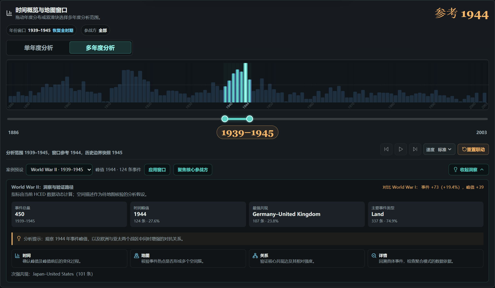
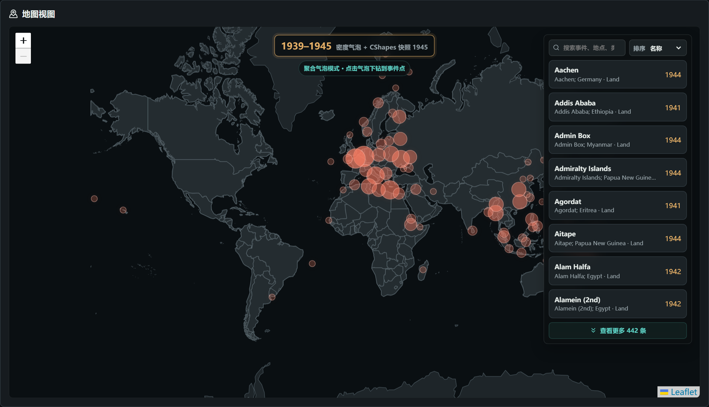
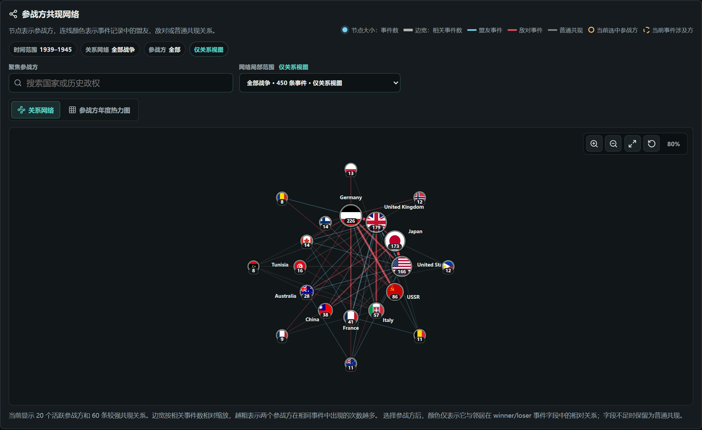
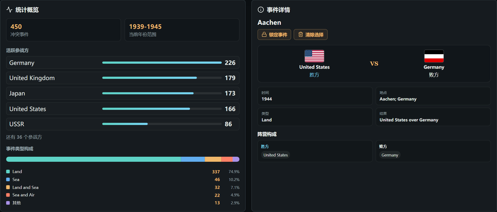

<!-- _class: lead -->
<!-- _paginate: false -->

BATTLEMAP · 数据可视化导论课程项目

# 全球军事冲突事件的 时空可视分析

基于 HCED 冲突事件与 CShapes 2.0 历史边界，覆盖 1886–2003 年

面对近两千条历史记录，我们怎样看出冲突在何时集中、在哪里发生，以及哪些参战方频繁共同出现？

<!--
大家好，我们的项目是 BattleMap。我们使用的数据集是HCED和Cshape，分别对应以年份为粒度的军事冲突事件和国家边界数据，我们关注三个问题：军事冲突何时集中、发生在哪里，哪些参战方频繁共同出现、以及他们的关系。
-->

---

<!-- _header: 01 · 问题与设计 -->

# 一次分析，需要在时间、地点和关系之间来回查看

### 我们把分析分成四步

<ol class="analysis-steps">
  <li><strong>先选时间</strong> 从年度分布中找到峰值或感兴趣的时期</li>
  <li><strong>再看地图</strong> 判断事件是集中在一个区域，还是分布在多个战区</li>
  <li><strong>比较参战方</strong> 查看哪些实体频繁出现在同一事件中</li>
  <li><strong>回到记录</strong> 检查图上的结论由哪些原始事件构成</li>
</ol>

时间范围、参战方和选中事件在各视图间同步，用户不必重复设置筛选条件。

<!--
分析路径包括时间定位（可以选择单年份和年份区间）、大地图观察、国家关系比较和军事冲突事件核查。

-->

---

<!-- _header: 02 · 操作演示 -->
<!-- _class: demo -->

# 以 1939–1945 年为例

  <video class="video-player" controls preload="metadata" poster="./assets/demo-poster.png" src="./assets/demo.mp4"></video>
  
  约 70 秒

<!--
下面看 1939 到 1945 年的实际分析。
-->

---

<!-- _header: 03 · 案例结果 -->

# 二战窗口中，我们看到了什么？

  
<b>450</b>1939–1945 年事件

  
<b>124</b>1944 年事件，窗口内最高

  
<b>74.9%</b>Land 类型事件占比

<ul class="finding-list">
  <li><strong>时间：</strong>事件数量在 1944 年达到峰值。</li>
  <li><strong>空间：</strong>欧洲和亚太均出现明显聚集。</li>
  <li><strong>关系：</strong>Germany–United Kingdom 与 Japan–United States 是两组高频共现关系。</li>
</ul>

<!--
二战窗口有 450 条事件，1944 年以 124 条达到峰值，陆战占 74.9%。欧洲和亚太均有事件聚集，网络也有两组高频关系，比如 US-Japan， USSR-Germany
-->

---

<!-- _header: 04 · 项目贡献与技术难点 -->

# 我们主要做了两类工作

### 面向分析的设计

- 使用聚合气泡和事件点，支持不同粒度的地图可视化
- 标明分析区间、地图参考年份和实际采用的历史边界快照
- 点击地图或时间轴中的事件后，详情和关系图同步更新

### 数据与工程实现

- 清洗 HCED 字段、坐标和参战方名称
- 按年份选择 CShapes 历史边界
- 使用 React 共享状态连接各视图，并通过 URL 保存当前分析条件

<!--
我们使用聚合气泡和事件点，支持不同粒度的地图可视化，联动各视图包括大地图的国家边界，事件，国家阵营等。
同时也进行了一系列的数据清洗，统一国家别名和不同时期的名称，并匹配历史边界。同时我们也下载了不同时期的国旗静态资源，保证了国旗动态随时间变化

-->

---

<!-- _header: Appendix A · 数据说明 -->
<!-- _class: appendix -->

# 两个数据集共同构成分析语境

### HCED Data v3

<b>提供什么：</b>带时间、地点、参战方和结果的军事冲突事件。

<b>本项目使用：</b>1,920 条记录，覆盖 1886–2003 年。

<b>示例事件 · Aachen1944</b>
1944 · Aachen, Germany
United States vs Germany · Land

记录是 conflict event；参战方共现不直接等于联盟或敌对。

### CShapes 2.0

<b>提供什么：</b>不同历史时期的国家或领土边界几何。

<b>本项目使用：</b>2,930 个快照要素，与分析年份匹配显示。

<b>示例快照 · United States of America</b>
snapshot_year: 1890 · MultiPolygon
有效期起点 1886 · 来源 CShapes 2.0

边界不表示战线、占领区或实际控制范围。

HCED 决定“事件何时、在哪里发生”，CShapes 提供对应年份的历史边界背景；两者按时间与空间共同参与地图分析。

> 数据来源、许可与清洗步骤详见项目 README。

---

<!-- _header: Appendix B · 视图选择 -->
<!-- _class: appendix -->

# 各视图分别回答什么问题？

<figure>
  
  <figcaption><b>什么时候集中？</b>年度柱形与区间选择定位峰值和分析窗口。</figcaption>
</figure>
<figure>
  
  <figcaption><b>事件在哪里聚集？</b>位置表示经纬度，多年气泡表示事件聚集数量。</figcaption>
</figure>
<figure>
  
  <figcaption><b>谁与谁经常共现？</b>节点大小表示事件数，边宽表示共现次数。</figcaption>
</figure>
<figure>
  
  <figcaption><b>结论由哪些记录构成？</b>统计概览保留整体结构，事件详情提供具体核查入口。</figcaption>
</figure>

---

<!-- _header: Appendix C · 状态管理 -->
<!-- _class: appendix -->

# 各视图如何保持一致？

  
<b>用户操作</b> 选择年份、参战方或事件

  
<b>共享状态</b> 保存当前分析条件

  
<b>派生计算</b> 筛选、聚合并生成图表数据

  
<b>视图更新</b> 时间、地图、关系和详情同步变化

### 用户看到的分析条件

- 单年度或多年度分析
- 当前年份与年份范围
- 聚焦的参战方
- 当前选中或锁定的事件

<code>analysisMode</code> · <code>selectedYearRange</code> · <code>currentYear</code> · <code>selectedParticipant</code> · <code>selectedBattleId</code>

### 为了保持可复现

- 当前分析条件写入 URL
- 分享链接可以恢复年份和参战方
- 锁定事件后，筛选变化不会立即清空详情
- 关系图的局部筛选不改变其他视图

---

<!-- _header: Appendix D · 分工与复现 -->
<!-- _class: appendix -->

# 成员分工、运行方式与 AI 使用

### 王洁睿

- HCED 下载、清洗与字段映射
- CShapes 快照生成与年份匹配
- Map View、历史边界呈现与地图交互

### 赵家玉

- Timeline 与案例分析
- 关系网络及关系数据处理
- 时间、地图与网络间的联动优化

### 江舜尧

- React/Vite 项目架构
- 页面布局、全局状态与系统集成
- 展开详情页、统计概览与事件详情
- UI 统一、README 与提交文档

<b>共同完成：</b>跨模块联调、自动化测试、案例复核与最终答辩验收。

<strong>AI 使用：</strong>使用 OpenAI Codex 辅助代码审查、调试、测试补充和文档整理。数据选择、分析问题、视图与交互设计以及最终验收由团队成员完成。

