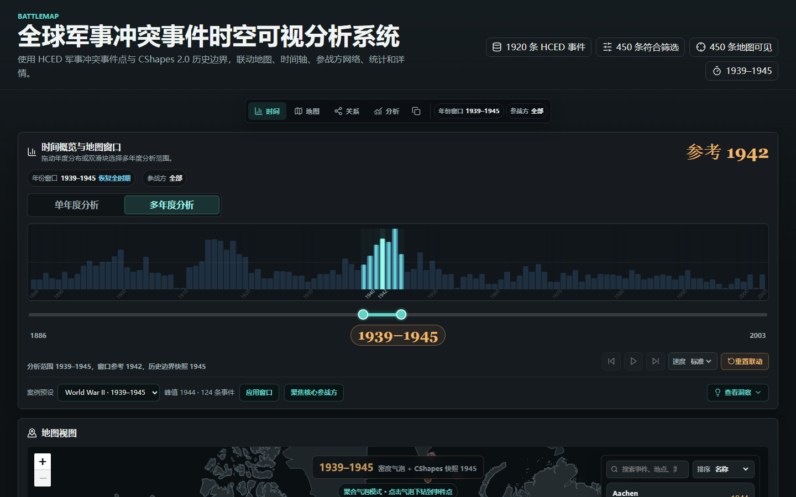
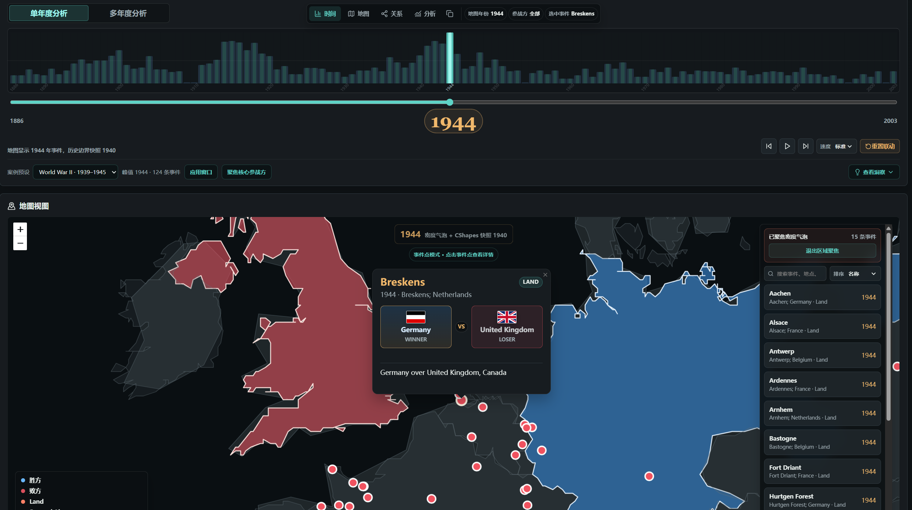

<!-- _class: lead -->
<!-- _paginate: false -->

<p class="eyebrow">BATTLEMAP · 数据可视化导论课程项目</p>

# 全球军事冲突事件的<br>时空可视分析

<p class="subtitle">基于 HCED 冲突事件与 CShapes 2.0 历史边界，覆盖 1886–2003 年</p>

<p class="question">面对近两千条历史记录，我们怎样看出冲突在何时集中、在哪里发生，以及哪些参战方频繁共同出现？</p>

<!--
成员 A · 约 15 秒
我们的数据包含 1886 到 2003 年的近两千条军事冲突事件。项目希望回答三个问题：冲突在什么时候集中、主要发生在哪里、哪些参战方经常同时出现。
-->

---

<!-- _header: 01 · 问题与设计 -->

# 一次分析，需要在时间、地点和关系之间来回查看

<div class="columns-64 center">
<div class="screen">



</div>
<div>

### 我们把分析分成四步

<ol class="analysis-steps">
  <li><strong>先选时间</strong><br><span>从年度分布中找到峰值或感兴趣的时期</span></li>
  <li><strong>再看地图</strong><br><span>判断事件是集中在一个区域，还是分布在多个战区</span></li>
  <li><strong>比较参战方</strong><br><span>查看哪些实体频繁出现在同一事件中</span></li>
  <li><strong>回到记录</strong><br><span>检查图上的结论由哪些原始事件构成</span></li>
</ol>

</div>
</div>

<p class="takeaway">时间范围、参战方和选中事件在各视图间同步，用户不必重复设置筛选条件。</p>

<!--
成员 A · 约 25–30 秒
单独看一张图很难回答这些问题，所以我们把分析过程分成四步：先从时间轴选定时期，再到地图确认空间分布，然后看参战方关系，最后回到具体事件。各视图共享筛选状态，用户可以沿着同一个问题继续分析。
-->

---

<!-- _header: 02 · 操作演示 -->
<!-- _class: demo -->

# 以 1939–1945 年为例

<div class="video-wrap">
  <video class="video-player" controls preload="metadata" poster="./assets/demo-poster.png" src="./assets/demo-short.mp4"></video>
  
  <span class="video-badge">约 60 秒</span>
</div>

<p class="small">备用文件：<code>demo-short.mp4</code>　·　<a href="../app/?mode=multi&year=1944&start=1939&end=1945#timeline-overview">打开在线案例</a></p>

<!--
成员 B · 约 55–60 秒
视频依次展示：选择二战时间窗口；定位 1944 年峰值；查看欧洲和亚太地区的事件分布；比较主要参战方关系；点击具体事件查看原始记录。
-->

---

<!-- _header: 03 · 案例结果 -->

# 二战窗口中，我们看到了什么？

<div class="metrics">
  <div class="metric"><b>450</b><span>1939–1945 年事件</span></div>
  <div class="metric"><b>124</b><span>1944 年事件，窗口内最高</span></div>
  <div class="metric"><b>74.9%</b><span>Land 类型事件占比</span></div>
</div>

<div class="columns-55 center">
<div class="screen">



</div>
<div>

<ul class="finding-list">
  <li><strong>时间：</strong>事件数量在 1944 年达到峰值，而不是在窗口末年最高。</li>
  <li><strong>空间：</strong>欧洲和亚太均出现明显聚集，不能用单一战区概括。</li>
  <li><strong>关系：</strong>Germany–United Kingdom 与 Japan–United States 是两组高频共现关系。</li>
</ul>

<p class="note">与一战窗口相比，二战多 73 条事件（约 19.4%）。但总量只是起点，时间分布和关系结构同样重要。</p>

</div>
</div>

<!--
成员 C · 约 40 秒
二战窗口共有 450 条事件，1944 年达到 124 条峰值，陆地事件约占四分之三。地图显示欧洲和亚太都有明显聚集，关系图中也出现两组主要关系。因此，这批记录呈现的是多个战区同时增强，而不只是总量上升。
-->

---

<!-- _header: 04 · 项目贡献与技术难点 -->

# 我们主要做了两类工作

<div class="columns contribution">
<div>

### 面向分析的设计

- 单年模式显示具体事件点，多年模式显示聚合气泡，避免混淆两种时间含义
- 同时标明分析区间、地图参考年份和实际采用的历史边界快照
- 点击地图或时间轴中的事件后，详情和关系图同步更新

</div>
<div>

### 数据与工程实现

- 清洗 HCED 字段、坐标和参战方名称，并保留原始字段用于核查
- 按年份选择 CShapes 历史边界，明确它不代表战线或占领区
- 使用 React 共享状态连接各视图，并通过 URL 保存当前分析条件

</div>
</div>

<div class="project-evidence">
  <span><b>1,920</b> 条前端事件</span>
  <span><b>38</b> 次 Git 提交</span>
  <span><b>74</b> 项单元测试</span>
  <span>Playwright 端到端测试</span>
</div>

<p class="takeaway">最终目标不是替历史事件下结论，而是让分析者能够发现模式，并随时检查结论所依据的记录。</p>

<!--
成员 C · 约 25 秒
我们的工作一部分是分析设计，例如区分单年事件和多年聚合、说明历史边界的含义；另一部分是数据和工程实现，包括参战方清洗、边界快照匹配和跨视图状态同步。系统的定位是辅助探索，并让每个结论都可以回到原始记录检查。
-->

---

<!-- _header: Appendix A · 数据说明 -->
<!-- _class: appendix -->

# 数据来源与使用限制

| 项目 | 说明 |
| --- | --- |
| 主数据 | Historical Conflict Event Dataset (HCED Data v3) |
| 时间范围 | 1886–2003 |
| 有效记录 | 1,920 条具有年份和经纬度的事件 |
| 历史边界 | CShapes 2.0 国家／领土边界 |
| 处理方式 | Node.js 脚本完成下载、过滤、字段映射和名称规范化 |

- HCED 中的记录是 **conflict event**，不一定都是狭义的 battle。
- 两个参战方“共现”只表示它们出现在同一条事件记录中，不直接表示联盟或敌对。
- CShapes 提供国家或领土边界，不表示战线、占领区或实际控制范围。

> 详细来源、许可和处理步骤见项目 README。

---

<!-- _header: Appendix B · 视图选择 -->
<!-- _class: appendix -->

# 各视图分别回答什么问题？

| 问题 | 使用的视图 | 主要编码 |
| --- | --- | --- |
| 哪些年份事件较多？ | 年度柱形图、区间选择 | 柱高表示事件数 |
| 事件集中在哪里？ | 历史地图 | 位置表示经纬度；多年气泡大小表示聚集数量 |
| 哪些参战方经常共同出现？ | 共现网络、年度热力图 | 节点大小表示事件数；边宽表示共现次数 |
| 图形对应哪些记录？ | 地图下钻、事件详情 | 展示地点、年份、参战方和原始描述 |

<p class="note">颜色主要用于区分事件类型、关系角色和当前选择，不用于表示事件严重程度。</p>

---

<!-- _header: Appendix C · 状态管理 -->
<!-- _class: appendix -->

# 各视图如何保持一致？

<div class="state-flow">
  <div><b>用户操作</b><br>选择年份、参战方或事件</div>
  <div><b>共享状态</b><br>保存当前分析条件</div>
  <div><b>派生计算</b><br>筛选、聚合并生成图表数据</div>
  <div><b>视图更新</b><br>时间、地图、关系和详情同步变化</div>
</div>

<div class="columns-55">
<div>

### 主要状态

- `analysisMode`
- `selectedYearRange`
- `currentYear`
- `selectedParticipant`
- `selectedBattleId`

</div>
<div>

### 为了便于复现

- 当前分析条件写入 URL
- 分享链接可以恢复年份和参战方
- 锁定事件后，筛选变化不会立即清空详情
- 关系图的局部筛选不改变其他视图

</div>
</div>

---

<!-- _header: Appendix D · 分工与复现 -->
<!-- _class: appendix -->

# 成员分工、运行方式与 AI 使用

<div class="columns-3">
<div>

### 成员 A

- HCED 数据清洗
- CShapes 快照生成
- 历史实体名称处理

</div>
<div>

### 成员 B

- 时间视图与案例分析
- 关系网络与视图联动
- 交互测试与调整

</div>
<div>

### 成员 C

- React/Vite 项目架构
- 全局状态与系统集成
- 详情、统计和文档

</div>
</div>

```bash
npm install
npm run build:hced
npm run build:cshapes
npm test
npm run build
npm run test:e2e
```

<p class="small"><strong>AI 使用：</strong>使用 OpenAI Codex 辅助代码审查、调试、测试补充和文档整理。数据选择、分析问题、视图与交互设计以及最终验收由团队成员完成。</p>
